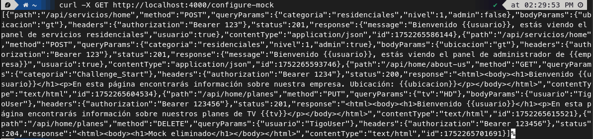
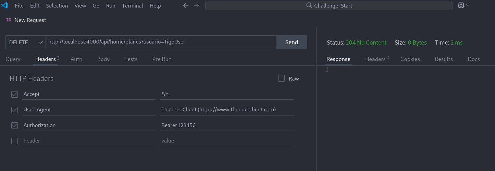
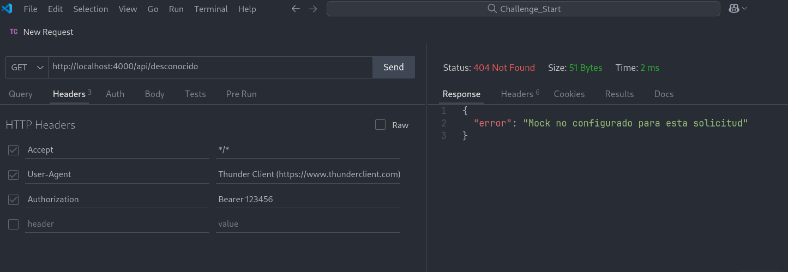

# 🚀 Challenge_Start

## ⚙️ Instalación y Ejecución
1. 🖥️ Abre una terminal de comandos en tu sistema.
2. 📦 Clona el repositorio con https o SSH:
    ```bash
    #https
    git clone https://github.com/Sebastian-G-0607/Challenge_Start.git
    #SSH
    git clone git@github.com:Sebastian-G-0607/Challenge_Start.git
    ```
3. 🔍 Verifica que tienes node.js y pnpm instalados:
    ```bash
    node -v
    pnpm -v
    ```
    Deberías ver las versiones instaladas en tu sistema. 
    Si no tienes `node.js`, puedes instalarlo desde [Node.js](https://nodejs.org/).

    Si no tienes `pnpm`, puedes instalarlo globalmente con:
    ```bash
    npm install -g pnpm
     ```

4. 📂 Navega al directorio del proyecto:
    ```bash
    cd Challenge_Start/solution
    ```
5. 📥 Instala las dependencias:
    ```bash
    pnpm install
    ```
6. ▶️ Ejecuta la aplicación en modo desarrollo:
    ```bash
    pnpm run dev
    ```
#### 🎉 ¡Listo! Ahora la aplicación debería estar corriendo en `http://localhost:4000`.

---

## 🛠️ Configuraciones y solicitudes
Esta aplicación permite configurar mocks para diferentes rutas y métodos HTTP. Puedes enviar solicitudes para configurar, obtener o eliminar mocks.

Para configurar un mock, debes usar la siguiente estructura en tu solicitud POST:
### 📝 Estructura de la solicitud
```json
{
     "path": "/ruta/del/mock",
     "method": "GET|POST|PUT|DELETE",
     "queryParams": {
          "param1": "valor1",
          "param2": "valor2"
     },
     "bodyParams": {
          "param1": "valor1",
          "param2": "valor2"
     },
     "headers": {
          "header1": "valor1",
          "header2": "valor2"
     },
     "status": 200,
     //La respuesta puede ser un objeto JSON
     "response": {
          "message": "Respuesta personalizada",
          "data": "Data de la respuesta"
     },
     // O bien un HTML
     "response": "<html><body><h1>Respuesta HTML</h1></body></html>",

     "contentType": "application/json|text/html"
}
```

---

### 🧩 Configurar un Mock
Por ejemplo, para configurar un mock que responda a una solicitud POST a `/api/servicios/home` con ciertos parámetros, puedes ejecutar el siguiente comando en la terminal:

```bash
curl -X POST http://localhost:4000/configure-mock \
     -H "Content-Type: application/json" \
     -d '{                                   
        "path": "/api/servicios/home",
        "method": "POST",
        "queryParams": {
            "categoria": "residenciales",
            "nivel": 1,
            "admin": false
        },
        "bodyParams": {
            "ubicacion": "gt"
        },
        "headers": {
            "authorization": "Bearer 123"
        },
        "status": 201,
        "response": { 
            "message": "Bienvenido {{usuario}}, estás viendo el panel de servicios residenciales",
            "usuario": true
        },
        "contentType": "application/json"
    }'
```

✨ `{{usuario}}` se reemplazará por el valor del parámetro `usuario` enviado en la url de la solicitud. Esto permite personalizar la respuesta según los parámetros de la solicitud.

---

### 🔍 Obtener un Mock previamente configurado
Para obtener la respuesta del mock configurado aquí arriba, puedes hacer una solicitud GET a la ruta configurada. Es importante que se envíen todos los datos necesarios tanto en la ruta como en el body de la request. De igual forma, los headers como el Authorization deben incluirse y coincidir. Por ejemplo:

```bash
curl -X POST "http://localhost:4000/api/servicios/home?categoria=residenciales&nivel=1&usuario=TigoClient&admin=false" \
     -H "authorization: Bearer 123" \
     -H "Content-Type: application/json" \
     -d '{
          "ubicacion": "gt"
     }'
```

---

### 👑 Mock con usuario administrador
Si quieres un mock que responda a un usuario administrador, puedes configurar el mock de la siguiente manera, con un parametro admin en la url:

```bash
curl -X POST http://localhost:4000/configure-mock \
     -H "Content-Type: application/json" \
     -d '{
          "path": "/api/servicios/home",
          "method": "POST",
          "queryParams": {
                "categoria": "residenciales",
                "nivel": 1,
                "admin": true
          },
          "bodyParams": {
                "ubicacion": "gt"
          },
          "headers": {
                "authorization": "Bearer 123"
          },
          "status": 201,
          "response": {
                "message": "Bienvenido {{usuario}}, estás viendo el panel de administrador de {{empresa}}",
                "usuario": true
          },
          "contentType": "application/json"
     }'
```
Luego, puedes hacer una solicitud GET a la ruta configurada con el parámetro `admin`:

```bash
curl -X POST "http://localhost:4000/api/servicios/home?categoria=residenciales&nivel=1&usuario=TigoAdmin&admin=true&empresa=Tigo" \
     -H "authorization: Bearer 123" \
     -H "Content-Type: application/json" \
     -d '{
          "ubicacion": "gt"
     }'
```

---

### 📋 Obtener todos los Mocks configurados
Para obtener todos los mocks configurados, puedes hacer una solicitud GET a `/configure-mock`
```bash
curl -X GET http://localhost:4000/configure-mock
```

---

### 🗑️ Eliminar un Mock configurado
Para eliminar un mock previamente configurado, puedes hacer una solicitud DELETE a `/configure-mock/:{id}`, donde `{id}` es el ID del mock que deseas eliminar. Por ejemplo:

```bash
curl -X DELETE http://localhost:4000/configure-mock/12345
```
Primero se recomienda obtener la lista de mocks configurados para identificar el ID del mock que deseas eliminar. Puedes hacerlo con la solicitud GET a `/configure-mock`.

---

### 🖼️ Mock que retorna un HTML
Si deseas que un mock retorne un HTML, puedes configurar el mock de la siguiente manera:
```bash
curl -X POST http://localhost:4000/configure-mock \
     -H "Content-Type: application/json" \
     -d '{
          "path": "/api/home/about-us",
          "method": "GET",
          "queryParams": {
                "categoria": "Challenge_Start"
          },
          "headers": {
                "authorization": "Bearer 1234"
          },
          "status": 200,
          "response": "<html><body><h1>Bienvenido {{usuario}}</h1><p>En esta página encontrarás información sobre nuestra empresa. Ubicación: {{ubicacion}}</p></body></html>",
          "contentType": "text/html"
     }'
```
Luego, puedes hacer una solicitud GET a la ruta configurada:
```bash
curl -X GET "http://localhost:4000/api/home/about-us?categoria=Challenge_Start&usuario=TigoUser&ubicacion=Km%209.5%20Ctra%20a%20El%20Salvador,%20Santa%20Catarina%20Pinula,%20Torre%201" \
     -H "authorization: Bearer 1234" \
     -H "Content-Type: application/json"
```
### 🔄 Actualizar un Mock
Para actualizar un mock previamente configurado, puedes hacer una solicitud PUT a `/configure-mock/:{id}`, donde `{id}` es el ID del mock que deseas actualizar. Por ejemplo:
```bash
curl -X PUT http://localhost:4000/configure-mock/12345 \
     -H "Content-Type: application/json" \
     -d '{
          "path": "/api/servicios/admin"
     }'
```

Busca primero el ID del mock que deseas actualizar haciendo una solicitud GET a `/configure-mock`. Por ejemplo, el id del último mock en este caso es 1752265701691 (los ID son variables).




### Mock con método PUT
Si deseas configurar un mock que responda a un método PUT, puedes hacerlo de la siguiente manera:
```bash
curl -X POST http://localhost:4000/configure-mock \
     -H "Content-Type: application/json" \
     -d '{
          "path": "/api/home/planes",
          "method": "PUT",
          "queryParams": {
                "tv": "HD"
          },
          "bodyParams": {
                "usuario": "TigoUser"
          },
          "headers": {
                "authorization": "Bearer 123456"
          },
          "status": 201,
          "response": "<html><body><h1>Bienvenido {{usuario}}</h1><p>En esta página encontrarás información sobre nuestros planes de TV {{tv}}</p></body></html>",
          "contentType": "text/html"
     }'
```
Luego, puedes hacer una solicitud PUT a la ruta configurada:

```bash
curl -X PUT "http://localhost:4000/api/home/planes?tv=HD" \
     -H "Content-Type: application/json" \
     -H "authorization: Bearer 123456" \
     -d '{
          "usuario": "TigoUser"
     }'
```
Como ves, los parámetos como "tv" o "usuario" pueden ser enviados en la query, en el body e incluso en los headers de la solicitud, y serán reemplazados en la respuesta del mock. 

### Mock con método DELETE
Si deseas configurar un mock que responda a un método DELETE, puedes hacerlo de la siguiente manera:
```bash
curl -X POST http://localhost:4000/configure-mock \
     -H "Content-Type: application/json" \
     -d '{
          "path": "/api/home/planes",
          "method": "DELETE",
          "queryParams": {
                "usuario": "TigoUser"
          },
          "headers": {
                "authorization": "Bearer 123456"
          },
          "status": 204,
          "response": "<html><body><h1>Mock eliminado</h1></body></html>",
          "contentType": "text/html"
     }'
```
Luego, puedes hacer una solicitud DELETE a la ruta configurada:

```bash
curl -X DELETE "http://localhost:4000/api/home/planes?usuario=TigoUser" \
     -H "Content-Type: application/json" \
     -H "authorization: Bearer 123456"
```
Puede que no veas una respuesta en la terminal, pero la respuesta incluye el código 204 que indica que la solicitud se ha procesado correctamente pero no hay contenido para devolver.

### Herramientas como Postman o Thunder Client
Puedes utilizar herramientas como Postman o Thunder Client para realizar pruebas de tus mocks de manera más visual e interactiva. Estas herramientas te permiten configurar fácilmente las solicitudes HTTP, agregar encabezados, parámetros y ver las respuestas de forma clara. Por ejemplo, con el mock configurado anteriormente con el método DELETE, puedes hacer una solicitud DELETE a la ruta `/api/home/planes` con los parámetros necesarios y ver la respuesta en la interfaz de la herramienta.



De igual forma, puedes utilizar estas herramientas para ver todos los detalles de la respuesta, incluyendo el código de estado, los encabezados y el cuerpo de la respuesta. Esto facilita la depuración y prueba de los mocks.



### ✅ Validaciones y Errores
Puedes modificar los mocks mostrados anteriormente o bien crear los tuyos completamente nuevos. La aplicación valida que los parámetros del mock estén correctamente estructurados y que los tipos de datos sean los esperados. Aquí hay algunas consideraciones importantes:

- La aplicación valida que los parámetros requeridos estén presentes y sean del tipo correcto.
- Si falta algún parámetro obligatorio o hay un error en la estructura de la solicitud, se retorna un mensaje de error descriptivo.
- Los errores comunes incluyen:
    - ❌ Parámetros faltantes o incorrectos al definir un mock.
    - ❌ Parámetros mal definidos o no válidos al actualizar un mock.
    - ❌ Intento de acceder a un mock que no existe.
    - ❌ Intento de acceder o eliminar un mock inexistente.
    - ❌ Mal formateo del JSON en la solicitud.
    - ❌ Errores generales del servidor.
- Todos los errores se devuelven en formato JSON con un mensaje claro para facilitar la depuración.

###   🧪 Pruebas Unitarias
La aplicación incluye pruebas unitarias para verificar el correcto funcionamiento de las rutas y la lógica de negocio. Puedes ejecutar las pruebas con el siguiente comando:
```bash
pnpm run test
```
Esto ejecutará las pruebas definidas en la carpeta `tests` y mostrará los resultados en la terminal. 

---

## 🏗️ Descripción de la arquitectura y diseño de la aplicación
La aplicación está diseñada para simular un servidor que responde a solicitudes HTTP con datos predefinidos (mocks). Utiliza Express.js para manejar las rutas y solicitudes, y permite configurar, obtener y eliminar mocks a través de una API RESTful. 

La arquitectura empleada es una arquitectura modular organizada dentro del enfoque monolítico tradicional. Cuenta con un solo entrypoint que inicia el servidor backend, típico de esta arquitectura. La aplicación está dividida en capas/funcionalidades que incluyen:


```
solution/
├── app/           # 🏢 Instancia de la aplicación Express y definición de middlewares globales
├── controllers/   # 🧑‍💻 Controladores (funciones) de las rutas de la aplicación
├── db/            # 💾 Configuración y gestión de datos (simulación de base de datos)
├── logs/          # 📑 Funciones para ver información de logs y errores
├── middlewares/   # 🛡️ Middlewares personalizados
├── routes/        # 🚦 Definición de rutas y endpoints de la API
├── schemas/       # 📏 Esquemas de validación de datos con Zod
├── utils/         # 🛠️ Funciones utilitarias y helpers
└── tests/         # 🧪 Pruebas unitarias
```
Durante el desarrollo de la aplicación, utilicé herramientas de IA para generar código y mejorar la eficiencia del proceso. Aquí hay un resumen de los prompts utilizados:

### 💬 Chat GPT
- **Explicación general del challenge**: Pedí a Chat GPT que me diera una descripción general del desafío y sus requisitos con el siguiente prompt:
  ```
  Explícame el challenge que me están pidiendo en este enunciado. No tengo experiencia previa con mocks y conozco muy poco de testing.
  ```
  Con la respuesta, obtuve una comprensión clara de los objetivos del challenge y cómo debía abordar la implementación. Además, en esta primera respuesta me proporcionó el "esqueleto" de la aplicación, lo que me ayudó a estructurar el proyecto desde el principio.

- **Explicación de herramientas de testing**: También consulté si era estrictamente necesario utilizar herramientas de testing para este challenge. Para esto utilicé el siguiente prompt:
  ```
  ¿El challenge requiere el uso de herramientas de testing?
  ```
  En un principio pensé que era necesario ya que había relacionado el término "mock" con pruebas unitarias, pero la respuesta me aclaró que no era obligatorio, por lo que al volver a leer el enunciado entendí el reto de una mejor manera.

- **Explicación de curl**: Para entender cómo utilizar `curl` para enviar solicitudes HTTP, utilicé el siguiente prompt:
  ```
  Explícame qué es curl y cómo usarlo para enviar solicitudes HTTP.
  ```
  Con esta información, pude realizar las solicitudes necesarias para configurar y probar los mocks.

- **Generación de respuestas dinámicas**: Para implementar la funcionalidad de respuestas dinámicas basadas en parámetros de la solicitud, utilicé el siguiente prompt:
  ```
    Actualmente mis mocks pueden retornar respuestas estáticas, ¿cómo puedo implementar respuestas dinámicas basadas en plantillas?
    ```
    Con la respuesta entendí que podía utilizar los parámetros tanto del body como de la query para generar respuestas dinámicas, lo que me permitió personalizar las respuestas según los datos enviados en la solicitud.

### 🐳 Deepseek
- **Comparación de objetos en JS**: Para comparar objetos en JavaScript y verificar si son iguales, utilicé el siguiente prompt:
  ```
  ¿Cómo puedo comparar dos objetos en JavaScript para ver si son iguales?
    ```
    Con esta información pude validar que los parametros enviados en la solicitud coincidieran con los de los mocks guardados, lo que me permitió responder correctamente a las solicitudes.

- **Subir pnpm-lock.yaml a GitHub**: Para saber si es correcto subir el archivo `pnpm-lock.yaml` a GitHub, utilicé el siguiente prompt:
  ```
  ¿Es correcto subir el archivo pnpm-lock.yaml a GitHub?
  ```
  Con la respuesta entendí que era una buena práctica incluir este archivo en el repositorio para asegurar que las dependencias se instalen de manera consistente en diferentes entornos.

### 🤖 GitHub Copilot
- **Generación de código**: Utilicé GitHub Copilot para ayudarme a generar código de manera más eficiente con ayuda de su autocompletado y sugerencias contextuales.

- **Tests unitarios**: Aunque no era obligatorio, decidí implementar pruebas unitarias para asegurarme de que la aplicación funcionara correctamente. Utilicé GitHub Copilot para generar las pruebas basadas en los mocks configurados y las rutas definidas.